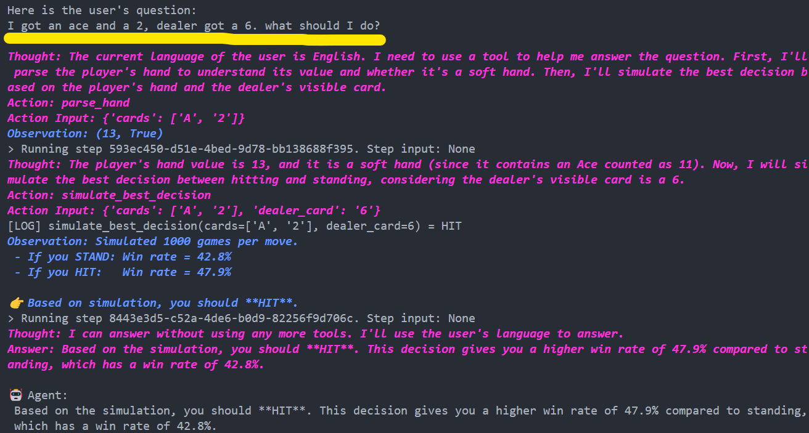

# BlackJack Agent with Judgeval Tracing

This project implements a Blackjack decision agent that uses LLMs to make optimal decisions in the game of Blackjack. The agent is instrumented with [Judgeval](https://github.com/JudgmentLabs/judgeval) for tracing and evaluation.

## Overview

The Blackjack agent uses LlamaIndex's ReActAgent, which implements the Reasoning and Acting (ReAct) paradigm for LLM-based agents. This approach combines reasoning and acting in an iterative process, allowing the agent to:

1. **Reason** about the current state and plan the next steps
2. **Act** by calling appropriate tools
3. **Observe** the results of those actions
4. **Repeat** the process until the task is complete

### LlamaIndex ReActAgent

The ReActAgent from LlamaIndex provides:

- A structured framework for tool use with LLMs
- Built-in reasoning capabilities through chain-of-thought prompting
- Automatic handling of tool selection and execution
- Support for multiple iterations of reasoning and acting

In this project, the ReActAgent is initialized with several custom tools:

- `parse_hand`: Parses a list of cards into a total value and determines if the hand is soft
- `hand_value`: Calculates the final value of a hand, taking Aces into account
- `simulate_best_decision`: Simulates both HIT and STAND outcomes to recommend the better move (Monte Carlo simulation)
- `simulate_best_decision_with_seen`: Simulates outcomes while accounting for previously seen cards

The agent uses these tools to analyze Blackjack scenarios and make optimal decisions based on simulations.

### Tracing with Judgeval

All these tools and the main agent function are traced using Judgeval, allowing you to analyze the agent's performance and behavior. This provides insights into:

- Which tools were called and in what order
- The inputs and outputs of each tool call
- The reasoning process of the agent
- Performance metrics for each component

## Installation

1. Clone this repository
2. Install the required packages:
   ```
   pip install -r requirements.txt
   ```

## Configuration

### Environment Variables

Create a `.env` file in the project root with the following variables:

```
OPENAI_API_KEY=your_openai_api_key
JUDGMENT_API_KEY=your_judgment_api_key
JUDGMENT_ORG_ID=your_judgment_org_id
```

You can get your Judgment API key and Organization ID by creating an account on the [Judgment Platform](https://judgment.dev/).

### Judgeval Configuration

The project is already configured to use Judgeval for tracing. Here's how it works:

1. A Tracer instance is created with a project name:

   ```python
   judgment = Tracer(project_name="blackjack_agent")
   ```

2. Tool functions are decorated with `@judgment.observe(span_type="tool")`:

   ```python
   @judgment.observe(span_type="tool")
   def parse_hand(cards: List[str]) -> Tuple[int, bool]:
       # Function implementation
   ```

3. The main agent function is decorated with `@judgment.observe(span_type="function")`:

   ```python
   @judgment.observe(span_type="function")
   def run_agent(user_input: str) -> str:
       # Function implementation
   ```

4. The OpenAI client can be wrapped for direct LLM call tracing:

   ```python
   from openai import OpenAI
   from judgeval.tracer import wrap

   openai_client = wrap(OpenAI())
   ```

## Usage

Run the agent with:

```
python blackjack.py
```

When prompted, enter your Blackjack scenario. For example:

```
I have a 10 and a 6, and the dealer shows a 9. Should I hit or stand?
```

The agent will analyze the scenario and provide a recommendation based on simulations.

## Demo



## Tracing with Judgeval

When you run the agent, all function calls and their results are traced and sent to the Judgment Platform. You can view the traces in the Judgment Platform dashboard.

### Integration with LlamaIndex ReActAgent

The integration between Judgeval and LlamaIndex's ReActAgent works as follows:

1. **Tool Tracing**: Each tool function is decorated with `@judgment.observe(span_type="tool")`, allowing Judgeval to trace when the ReActAgent calls these tools, what inputs it provides, and what outputs it receives.

2. **Agent Function Tracing**: The main `run_agent` function is decorated with `@judgment.observe(span_type="function")`, tracing the overall agent execution including the prompt and final response.

3. **LLM Call Handling Limitation**: The internal LLM calls made by the ReActAgent **cannot be directly traced** due to a fundamental compatibility issue between Judgeval and LlamaIndex's OpenAI client. Judgeval's `wrap()` function does not support the llama_index.llms.openai.OpenAI client type. Despite this limitation, you can still get valuable insights into the agent's behavior through the tool and function traces.


## Advanced Configuration

For more advanced Judgeval configuration options, refer to the [Judgeval documentation](https://github.com/JudgmentLabs/judgeval).
